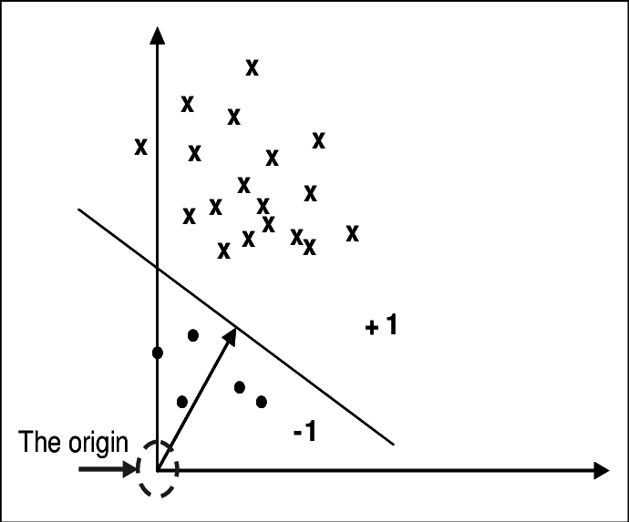
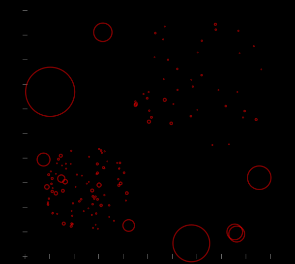
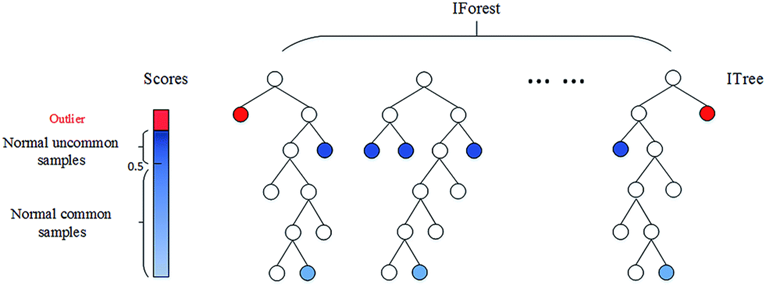
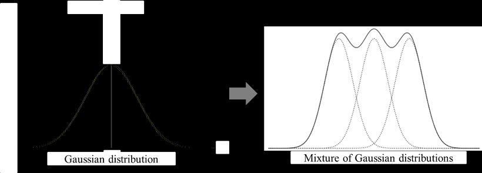
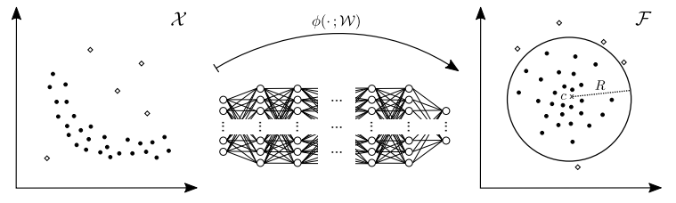
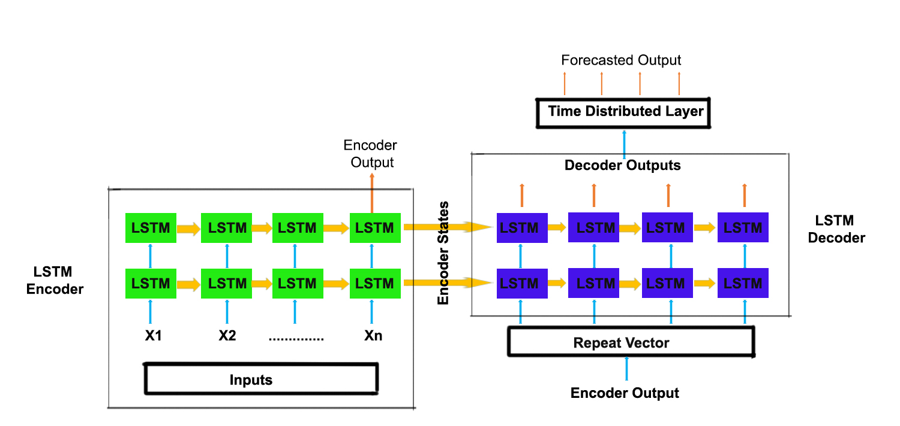

# Anomaly Detection 

## Table of Contents
1. [OCSVM](#ocsvm)
2. [LOF](#lof) 
3. [Isolation Forest](#isolation-forest)
4. [GMM](#gmm)
5. [Deep SVDD](#deep-svdd)
6. [LSTM Autoencoder](#lstm-autoencoder)

## OCSVM 
  
OC-SVM은 위의 그림과 같이 feature space 상에서 데이터를 원점과 가장 잘 분리하는 최대 마진 hyperplane을 찾음 
 

'''python

class OCSVM(BaseDetector):
    """Wrapper of scikit-learn one-class SVM Class with more functionalities.
    Unsupervised Outlier Detection.

    Estimate the support of a high-dimensional distribution.

    The implementation is based on libsvm.
    See http://scikit-learn.org/stable/modules/svm.html#svm-outlier-detection
    and :cite:`scholkopf2001estimating`.

    Parameters
    ----------
    kernel : string, optional (default='rbf')
         Specifies the kernel type to be used in the algorithm.
         It must be one of 'linear', 'poly', 'rbf', 'sigmoid', 'precomputed' or
         a callable.
         If none is given, 'rbf' will be used. If a callable is given it is
         used to precompute the kernel matrix.

    nu : float, optional
        An upper bound on the fraction of training
        errors and a lower bound of the fraction of support
        vectors. Should be in the interval (0, 1]. By default 0.5
        will be taken.

    degree : int, optional (default=3)
        Degree of the polynomial kernel function ('poly').
        Ignored by all other kernels.

    gamma : float, optional (default='auto')
        Kernel coefficient for 'rbf', 'poly' and 'sigmoid'.
        If gamma is 'auto' then 1/n_features will be used instead.

    coef0 : float, optional (default=0.0)
        Independent term in kernel function.
        It is only significant in 'poly' and 'sigmoid'.

    tol : float, optional
        Tolerance for stopping criterion.

    shrinking : bool, optional
        Whether to use the shrinking heuristic.

    cache_size : float, optional
        Specify the size of the kernel cache (in MB).

    verbose : bool, default: False
        Enable verbose output. Note that this setting takes advantage of a
        per-process runtime setting in libsvm that, if enabled, may not work
        properly in a multithreaded context.

    max_iter : int, optional (default=-1)
        Hard limit on iterations within solver, or -1 for no limit.

    contamination : float in (0., 0.5), optional (default=0.1)
        The amount of contamination of the data set, i.e.
        the proportion of outliers in the data set. Used when fitting to
        define the threshold on the decision function.

    Attributes
    ----------
    support_ : array-like, shape = [n_SV]
        Indices of support vectors.

    support_vectors_ : array-like, shape = [nSV, n_features]
        Support vectors.

    dual_coef_ : array, shape = [1, n_SV]
        Coefficients of the support vectors in the decision function.

    coef_ : array, shape = [1, n_features]
        Weights assigned to the features (coefficients in the primal
        problem). This is only available in the case of a linear kernel.

        `coef_` is readonly property derived from `dual_coef_` and
        `support_vectors_`

    intercept_ : array, shape = [1,]
        Constant in the decision function.

    decision_scores_ : numpy array of shape (n_samples,)
        The outlier scores of the training data.
        The higher, the more abnormal. Outliers tend to have higher
        scores. This value is available once the detector is fitted.

    threshold_ : float
        The threshold is based on ``contamination``. It is the
        ``n_samples * contamination`` most abnormal samples in
        ``decision_scores_``. The threshold is calculated for generating
        binary outlier labels.

    labels_ : int, either 0 or 1
        The binary labels of the training data. 0 stands for inliers
        and 1 for outliers/anomalies. It is generated by applying
        ``threshold_`` on ``decision_scores_``.
    """

    def __init__(self, kernel='rbf', degree=3, gamma='auto', coef0=0.0,
                 tol=1e-3, nu=0.5, shrinking=True, cache_size=200,
                 verbose=False, max_iter=-1, contamination=0.1):
        super(OCSVM, self).__init__(contamination=contamination)
        self.kernel = kernel
        self.degree = degree
        self.gamma = gamma
        self.coef0 = coef0
        self.tol = tol
        self.nu = nu
        self.shrinking = shrinking
        self.cache_size = cache_size
        self.verbose = verbose
        self.max_iter = max_iter

    def fit(self, X, y=None, sample_weight=None, **params):
        """Fit detector. y is ignored in unsupervised methods.

        Parameters
        ----------
        X : numpy array of shape (n_samples, n_features)
            The input samples.

        y : Ignored
            Not used, present for API consistency by convention.

        sample_weight : array-like, shape (n_samples,)
            Per-sample weights. Rescale C per sample. Higher weights
            force the classifier to put more emphasis on these points.

        Returns
        -------
        self : object
            Fitted estimator.
        """
        # validate inputs X and y (optional)
        X = check_array(X)
        self._set_n_classes(y)

        self.detector_ = OneClassSVM(kernel=self.kernel,
                                     degree=self.degree,
                                     gamma=self.gamma,
                                     coef0=self.coef0,
                                     tol=self.tol,
                                     nu=self.nu,
                                     shrinking=self.shrinking,
                                     cache_size=self.cache_size,
                                     verbose=self.verbose,
                                     max_iter=self.max_iter)
        self.detector_.fit(X=X, y=y, sample_weight=sample_weight,
                           **params)

        # invert decision_scores_. Outliers comes with higher outlier scores
        self.decision_scores_ = invert_order(
            self.detector_.decision_function(X))
        self._process_decision_scores()
        return self

    def decision_function(self, X):
        """Predict raw anomaly score of X using the fitted detector.

        The anomaly score of an input sample is computed based on different
        detector algorithms. For consistency, outliers are assigned with
        larger anomaly scores.

        Parameters
        ----------
        X : numpy array of shape (n_samples, n_features)
            The training input samples. Sparse matrices are accepted only
            if they are supported by the base estimator.

        Returns
        -------
        anomaly_scores : numpy array of shape (n_samples,)
            The anomaly score of the input samples.
        """
        check_is_fitted(self, ['decision_scores_', 'threshold_', 'labels_'])
        # Invert outlier scores. Outliers comes with higher outlier scores
        return invert_order(self.detector_.decision_function(X))

    @property
    def support_(self):
        """Indices of support vectors.
        Decorator for scikit-learn One class SVM attributes.
        """
        return self.detector_.support_

    @property
    def support_vectors_(self):
        """Support vectors.
        Decorator for scikit-learn One class SVM attributes.
        """
        return self.detector_.support_vectors_

    @property
    def dual_coef_(self):
        """Coefficients of the support vectors in the decision function.
        Decorator for scikit-learn One class SVM attributes.
        """
        return self.detector_.dual_coef_

    @property
    def coef_(self):
        """Weights assigned to the features (coefficients in the primal
        problem). This is only available in the case of a linear kernel.
        `coef_` is readonly property derived from `dual_coef_` and
        `support_vectors_`
        Decorator for scikit-learn One class SVM attributes.
        """
        return self.detector_.coef_

    @property
    def intercept_(self):
        """ Constant in the decision function.
        Decorator for scikit-learn One class SVM attributes.
        """
        return self.detector_.intercept_
'''

## LOF 

  
각각의 관측치가 데이터 안에서 얼마나 벗어나 있는가에 대한 정도(이상치 정도)를 나타냄. 모든 데이터를 전체적으로 고려하는 것이 아니라, 해당 관측치의 주변 데이터를 이용하여 국소적 관점으로 이상치 정도를 파악하는 것임. 주변 데이터를 몇개까지 고려할 것인가를 나타내는 k라는 하이퍼파라미터만 결정하면 된다는 장점이 있음 
 

'''python 

class LOF(BaseDetector):
    """Wrapper of scikit-learn LOF Class with more functionalities.
    Unsupervised Outlier Detection using Local Outlier Factor (LOF).

    The anomaly score of each sample is called Local Outlier Factor.
    It measures the local deviation of density of a given sample with
    respect to its neighbors.
    It is local in that the anomaly score depends on how isolated the object
    is with respect to the surrounding neighborhood.
    More precisely, locality is given by k-nearest neighbors, whose distance
    is used to estimate the local density.
    By comparing the local density of a sample to the local densities of
    its neighbors, one can identify samples that have a substantially lower
    density than their neighbors. These are considered outliers.
    See :cite:`breunig2000lof` for details.

    Parameters
    ----------
    n_neighbors : int, optional (default=20)
        Number of neighbors to use by default for `kneighbors` queries.
        If n_neighbors is larger than the number of samples provided,
        all samples will be used.

    algorithm : {'auto', 'ball_tree', 'kd_tree', 'brute'}, optional
        Algorithm used to compute the nearest neighbors:

        - 'ball_tree' will use BallTree
        - 'kd_tree' will use KDTree
        - 'brute' will use a brute-force search.
        - 'auto' will attempt to decide the most appropriate algorithm
          based on the values passed to :meth:`fit` method.

        Note: fitting on sparse input will override the setting of
        this parameter, using brute force.

    leaf_size : int, optional (default=30)
        Leaf size passed to `BallTree` or `KDTree`. This can
        affect the speed of the construction and query, as well as the memory
        required to store the tree. The optimal value depends on the
        nature of the problem.

    metric : string or callable, default 'minkowski'
        metric used for the distance computation. Any metric from scikit-learn
        or scipy.spatial.distance can be used.

        If 'precomputed', the training input X is expected to be a distance
        matrix.

        If metric is a callable function, it is called on each
        pair of instances (rows) and the resulting value recorded. The callable
        should take two arrays as input and return one value indicating the
        distance between them. This works for Scipy's metrics, but is less
        efficient than passing the metric name as a string.

        Valid values for metric are:

        - from scikit-learn: ['cityblock', 'cosine', 'euclidean', 'l1', 'l2',
          'manhattan']

        - from scipy.spatial.distance: ['braycurtis', 'canberra', 'chebyshev',
          'correlation', 'dice', 'hamming', 'jaccard', 'kulsinski',
          'mahalanobis', 'matching', 'minkowski', 'rogerstanimoto',
          'russellrao', 'seuclidean', 'sokalmichener', 'sokalsneath',
          'sqeuclidean', 'yule']

        See the documentation for scipy.spatial.distance for details on these
        metrics:
        http://docs.scipy.org/doc/scipy/reference/spatial.distance.html

    p : integer, optional (default = 2)
        Parameter for the Minkowski metric from
        sklearn.metrics.pairwise.pairwise_distances. When p = 1, this is
        equivalent to using manhattan_distance (l1), and euclidean_distance
        (l2) for p = 2. For arbitrary p, minkowski_distance (l_p) is used.
        See http://scikit-learn.org/stable/modules/generated/sklearn.metrics.pairwise.pairwise_distances

    metric_params : dict, optional (default = None)
        Additional keyword arguments for the metric function.

    contamination : float in (0., 0.5), optional (default=0.1)
        The amount of contamination of the data set, i.e. the proportion
        of outliers in the data set. When fitting this is used to define the
        threshold on the decision function.

    n_jobs : int, optional (default = 1)
        The number of parallel jobs to run for neighbors search.
        If ``-1``, then the number of jobs is set to the number of CPU cores.
        Affects only kneighbors and kneighbors_graph methods.

    novelty : bool (default=False)
        By default, LocalOutlierFactor is only meant to be used for outlier
        detection (novelty=False). Set novelty to True if you want to use
        LocalOutlierFactor for novelty detection. In this case be aware that
        that you should only use predict, decision_function and score_samples
        on new unseen data and not on the training set.

    Attributes
    ----------
    n_neighbors_ : int
        The actual number of neighbors used for `kneighbors` queries.

    decision_scores_ : numpy array of shape (n_samples,)
        The outlier scores of the training data.
        The higher, the more abnormal. Outliers tend to have higher
        scores. This value is available once the detector is
        fitted.

    threshold_ : float
        The threshold is based on ``contamination``. It is the
        ``n_samples * contamination`` most abnormal samples in
        ``decision_scores_``. The threshold is calculated for generating
        binary outlier labels.

    labels_ : int, either 0 or 1
        The binary labels of the training data. 0 stands for inliers
        and 1 for outliers/anomalies. It is generated by applying
        ``threshold_`` on ``decision_scores_``.
    """

    def __init__(self, n_neighbors=20, algorithm='auto', leaf_size=30,
                 metric='minkowski', p=2, metric_params=None,
                 contamination=0.1, n_jobs=1, novelty=True):
        super(LOF, self).__init__(contamination=contamination)
        self.n_neighbors = n_neighbors
        self.algorithm = algorithm
        self.leaf_size = leaf_size
        self.metric = metric
        self.p = p
        self.metric_params = metric_params
        self.n_jobs = n_jobs
        self.novelty = novelty

    # noinspection PyIncorrectDocstring
    def fit(self, X, y=None):
        """Fit detector. y is ignored in unsupervised methods.

        Parameters
        ----------
        X : numpy array of shape (n_samples, n_features)
            The input samples.

        y : Ignored
            Not used, present for API consistency by convention.

        Returns
        -------
        self : object
            Fitted estimator.
        """
        # validate inputs X and y (optional)
        X = check_array(X)
        self._set_n_classes(y)

        self.detector_ = LocalOutlierFactor(n_neighbors=self.n_neighbors,
                                            algorithm=self.algorithm,
                                            leaf_size=self.leaf_size,
                                            metric=self.metric,
                                            p=self.p,
                                            metric_params=self.metric_params,
                                            contamination=self.contamination,
                                            n_jobs=self.n_jobs,
                                            novelty=self.novelty)
        self.detector_.fit(X=X, y=y)

        # Invert decision_scores_. Outliers comes with higher outlier scores
        self.decision_scores_ = invert_order(
            self.detector_.negative_outlier_factor_)
        self._process_decision_scores()
        return self

    def decision_function(self, X):
        """Predict raw anomaly score of X using the fitted detector.

        The anomaly score of an input sample is computed based on different
        detector algorithms. For consistency, outliers are assigned with
        larger anomaly scores.

        Parameters
        ----------
        X : numpy array of shape (n_samples, n_features)
            The training input samples. Sparse matrices are accepted only
            if they are supported by the base estimator.

        Returns
        -------
        anomaly_scores : numpy array of shape (n_samples,)
            The anomaly score of the input samples.
        """

        check_is_fitted(self, ['decision_scores_', 'threshold_', 'labels_'])

        # Invert outlier scores. Outliers comes with higher outlier scores
        # noinspection PyProtectedMember
        try:
            return invert_order(self.detector_._score_samples(X))
        except AttributeError:
            try:
                return invert_order(self.detector_._decision_function(X))
            except AttributeError:
                return invert_order(self.detector_.score_samples(X))

    @property
    def n_neighbors_(self):
        """The actual number of neighbors used for kneighbors queries.
        Decorator for scikit-learn LOF attributes.
        """
        return self.detector_.n_neighbors_

'''

## Isolation Forest 

  
여러개의 의사결정 나무를 종합한 앙상블 기반 이상 탐지 기법으로 의사결정 나무를 지속적으로 분기시키면서 모든 데이터 관측치의 고립 정도 여부에 따라 이상치를 판별하는 방법임 
 

'''python 

class IForest(BaseDetector):
    """Wrapper of scikit-learn Isolation Forest with more functionalities.

    The IsolationForest 'isolates' observations by randomly selecting a
    feature and then randomly selecting a split value between the maximum and
    minimum values of the selected feature.
    See :cite:`liu2008isolation,liu2012isolation` for details.

    Since recursive partitioning can be represented by a tree structure, the
    number of splittings required to isolate a sample is equivalent to the path
    length from the root node to the terminating node.

    This path length, averaged over a forest of such random trees, is a
    measure of normality and our decision function.

    Random partitioning produces noticeably shorter paths for anomalies.
    Hence, when a forest of random trees collectively produce shorter path
    lengths for particular samples, they are highly likely to be anomalies.

    Parameters
    ----------
    n_estimators : int, optional (default=100)
        The number of base estimators in the ensemble.

    max_samples : int or float, optional (default="auto")
        The number of samples to draw from X to train each base estimator.

            - If int, then draw `max_samples` samples.
            - If float, then draw `max_samples * X.shape[0]` samples.
            - If "auto", then `max_samples=min(256, n_samples)`.

        If max_samples is larger than the number of samples provided,
        all samples will be used for all trees (no sampling).

    contamination : float in (0., 0.5), optional (default=0.1)
        The amount of contamination of the data set, i.e. the proportion
        of outliers in the data set. Used when fitting to define the threshold
        on the decision function.

    max_features : int or float, optional (default=1.0)
        The number of features to draw from X to train each base estimator.

            - If int, then draw `max_features` features.
            - If float, then draw `max_features * X.shape[1]` features.

    bootstrap : bool, optional (default=False)
        If True, individual trees are fit on random subsets of the training
        data sampled with replacement. If False, sampling without replacement
        is performed.

    n_jobs : integer, optional (default=1)
        The number of jobs to run in parallel for both `fit` and `predict`.
        If -1, then the number of jobs is set to the number of cores.

    behaviour : str, default='old'
        Behaviour of the ``decision_function`` which can be either 'old' or
        'new'. Passing ``behaviour='new'`` makes the ``decision_function``
        change to match other anomaly detection algorithm API which will be
        the default behaviour in the future. As explained in details in the
        ``offset_`` attribute documentation, the ``decision_function`` becomes
        dependent on the contamination parameter, in such a way that 0 becomes
        its natural threshold to detect outliers.

        .. versionadded:: 0.7.0
           ``behaviour`` is added in 0.7.0 for back-compatibility purpose.

        .. deprecated:: 0.20
           ``behaviour='old'`` is deprecated in sklearn 0.20 and will not be
           possible in 0.22.

        .. deprecated:: 0.22
           ``behaviour`` parameter will be deprecated in sklearn 0.22 and
           removed in 0.24.

        .. warning::
            Only applicable for sklearn 0.20 above.

    random_state : int, RandomState instance or None, optional (default=None)
        If int, random_state is the seed used by the random number generator;
        If RandomState instance, random_state is the random number generator;
        If None, the random number generator is the RandomState instance used
        by `np.random`.

    verbose : int, optional (default=0)
        Controls the verbosity of the tree building process.

    Attributes
    ----------
    estimators_ : list of DecisionTreeClassifier
        The collection of fitted sub-estimators.

    estimators_samples_ : list of arrays
        The subset of drawn samples (i.e., the in-bag samples) for each base
        estimator.

    max_samples_ : integer
        The actual number of samples

    decision_scores_ : numpy array of shape (n_samples,)
        The outlier scores of the training data.
        The higher, the more abnormal. Outliers tend to have higher
        scores. This value is available once the detector is
        fitted.

    threshold_ : float
        The threshold is based on ``contamination``. It is the
        ``n_samples * contamination`` most abnormal samples in
        ``decision_scores_``. The threshold is calculated for generating
        binary outlier labels.

    labels_ : int, either 0 or 1
        The binary labels of the training data. 0 stands for inliers
        and 1 for outliers/anomalies. It is generated by applying
        ``threshold_`` on ``decision_scores_``.
    """

    def __init__(self, n_estimators=100,
                 max_samples="auto",
                 contamination=0.1,
                 max_features=1.,
                 bootstrap=False,
                 n_jobs=1,
                 behaviour='old',
                 random_state=None,
                 verbose=0):
        super(IForest, self).__init__(contamination=contamination)
        self.n_estimators = n_estimators
        self.max_samples = max_samples
        self.max_features = max_features
        self.bootstrap = bootstrap
        self.n_jobs = n_jobs
        self.behaviour = behaviour
        self.random_state = random_state
        self.verbose = verbose

    def fit(self, X, y=None):
        """Fit detector. y is ignored in unsupervised methods.

        Parameters
        ----------
        X : numpy array of shape (n_samples, n_features)
            The input samples.

        y : Ignored
            Not used, present for API consistency by convention.

        Returns
        -------
        self : object
            Fitted estimator.
        """
        # validate inputs X and y (optional)
        X = check_array(X)
        self._set_n_classes(y)

        # In sklearn 0.20+ new behaviour is added (arg behaviour={'new','old'})
        # to IsolationForest that shifts the location of the anomaly scores
        # noinspection PyProtectedMember
        sklearn_version = _get_sklearn_version()
        if sklearn_version == 21:
            self.detector_ = IsolationForest(n_estimators=self.n_estimators,
                                             max_samples=self.max_samples,
                                             contamination=self.contamination,
                                             max_features=self.max_features,
                                             bootstrap=self.bootstrap,
                                             n_jobs=self.n_jobs,
                                             behaviour=self.behaviour,
                                             random_state=self.random_state,
                                             verbose=self.verbose)

        # Do not pass behaviour argument when sklearn version is < 0.20 or >0.21
        else:  # pragma: no cover
            self.detector_ = IsolationForest(n_estimators=self.n_estimators,
                                             max_samples=self.max_samples,
                                             contamination=self.contamination,
                                             max_features=self.max_features,
                                             bootstrap=self.bootstrap,
                                             n_jobs=self.n_jobs,
                                             random_state=self.random_state,
                                             verbose=self.verbose)

        self.detector_.fit(X=X, y=None, sample_weight=None)

        # invert decision_scores_. Outliers comes with higher outlier scores.
        self.decision_scores_ = invert_order(
            self.detector_.decision_function(X))
        self._process_decision_scores()
        return self

    def decision_function(self, X):
        """Predict raw anomaly score of X using the fitted detector.

        The anomaly score of an input sample is computed based on different
        detector algorithms. For consistency, outliers are assigned with
        larger anomaly scores.

        Parameters
        ----------
        X : numpy array of shape (n_samples, n_features)
            The training input samples. Sparse matrices are accepted only
            if they are supported by the base estimator.

        Returns
        -------
        anomaly_scores : numpy array of shape (n_samples,)
            The anomaly score of the input samples.
        """
        check_is_fitted(self, ['decision_scores_', 'threshold_', 'labels_'])
        # invert outlier scores. Outliers comes with higher outlier scores
        return invert_order(self.detector_.decision_function(X))

    @property
    def estimators_(self):
        """The collection of fitted sub-estimators.
        Decorator for scikit-learn Isolation Forest attributes.
        """
        return self.detector_.estimators_

    @property
    def estimators_samples_(self):
        """The subset of drawn samples (i.e., the in-bag samples) for
        each base estimator.
        Decorator for scikit-learn Isolation Forest attributes.
        """
        return self.detector_.estimators_samples_

    @property
    def max_samples_(self):
        """The actual number of samples.
        Decorator for scikit-learn Isolation Forest attributes.
        """
        return self.detector_.max_samples_

    @property
    def feature_importances_(self):
        """The impurity-based feature importance. The higher, the more
        important the feature. The importance of a feature is computed as the
        (normalized) total reduction of the criterion brought by that feature.
        It is also known as the Gini importance.

        .. warning::
        impurity-based feature importance can be misleading for
        high cardinality features (many unique values). See
        https://scikit-learn.org/stable/modules/generated/sklearn.inspection.permutation_importance.html
        as an alternative.

        Returns
        -------
        feature_importances_ : ndarray of shape (n_features,)
            The values of this array sum to 1, unless all trees are single node
            trees consisting of only the root node, in which case it will be an
            array of zeros.
        """
        check_is_fitted(self)
        all_importances = Parallel(
            n_jobs=self.n_jobs)(
            delayed(getattr)(tree, "feature_importances_")
            for tree in self.detector_.estimators_
            if tree.tree_.node_count > 1
        )

        if not all_importances:
            return np.zeros(self.n_features_in_, dtype=np.float64)

        all_importances = np.mean(all_importances, axis=0, dtype=np.float64)
        return all_importances / np.sum(all_importances)

'''
## GMM
  
복잡한 형태의 분포를 k개의 gaussian 분포로 쪼개어줌 

 

'''python

class GMM(BaseDetector):
    """Wrapper of scikit-learn Gaussian Mixture Model with more functionalities.
    Unsupervised Outlier Detection.

    See :cite:`aggarwal2015outlier` Chapter 2 for details.

    Parameters
    ----------
    n_components : int, default=1
        The number of mixture components.

    covariance_type : {'full', 'tied', 'diag', 'spherical'}, default='full'
        String describing the type of covariance parameters to use.

    tol : float, default=1e-3
        The convergence threshold. EM iterations will stop when the
        lower bound average gain is below this threshold.

    reg_covar : float, default=1e-6
        Non-negative regularization added to the diagonal of covariance.
        Allows to assure that the covariance matrices are all positive.

    max_iter : int, default=100
        The number of EM iterations to perform.

    n_init : int, default=1
        The number of initializations to perform. The best results are kept.

    init_params : {'kmeans', 'random'}, default='kmeans'
        The method used to initialize the weights, the means and the
        precisions.

    weights_init : array-like of shape (n_components, ), default=None
        The user-provided initial weights.
        If it is None, weights are initialized using the `init_params` method.

    means_init : array-like of shape (n_components, n_features), default=None
        The user-provided initial means,
        If it is None, means are initialized using the `init_params` method.

    precisions_init : array-like, default=None
        The user-provided initial precisions (inverse of the covariance
        matrices).
        If it is None, precisions are initialized using the 'init_params'
        method.

    random_state : int, RandomState instance or None, default=None
        Controls the random seed given to the method chosen to initialize the
        parameters.

    warm_start : bool, default=False
        If 'warm_start' is True, the solution of the last fitting is used as
        initialization for the next call of fit().

    verbose : int, default=0
        Enable verbose output.

    verbose_interval : int, default=10
        Number of iteration done before the next print.

    contamination : float in (0., 0.5), optional (default=0.1)
        The amount of contamination of the data set.

    Attributes
    ----------
    weights_ : array-like of shape (n_components,)
        The weights of each mixture components.

    means_ : array-like of shape (n_components, n_features)
        The mean of each mixture component.

    covariances_ : array-like
        The covariance of each mixture component.

    precisions_ : array-like
        The precision matrices for each component in the mixture.

    precisions_cholesky_ : array-like
        The cholesky decomposition of the precision matrices of each mixture
        component.

    converged_ : bool
        True when convergence was reached in fit(), False otherwise.

    n_iter_ : int
        Number of step used by the best fit of EM to reach the convergence.

    lower_bound_ : float
        Lower bound value on the log-likelihood (of the training data with
        respect to the model) of the best fit of EM.

    decision_scores_ : numpy array of shape (n_samples,)
        The outlier scores of the training data.

    threshold_ : float
        The threshold is based on ``contamination``. It is the
        ``n_samples * contamination`` most abnormal samples in
        ``decision_scores_``. The threshold is calculated for generating
        binary outlier labels.

    labels_ : int, either 0 or 1
        The binary labels of the training data. 0 stands for inliers
        and 1 for outliers/anomalies. It is generated by applying
        ``threshold_`` on ``decision_scores_``.
    """

    def __init__(
            self,
            n_components=1,
            covariance_type="full",
            tol=1e-3,
            reg_covar=1e-6,
            max_iter=100,
            n_init=1,
            init_params="kmeans",
            weights_init=None,
            means_init=None,
            precisions_init=None,
            random_state=None,
            warm_start=False,
            contamination=0.1,
    ):
        super().__init__(contamination=contamination)
        self.n_components = n_components
        self.covariance_type = covariance_type
        self.tol = tol
        self.reg_covar = reg_covar
        self.max_iter = max_iter
        self.n_init = n_init
        self.init_params = init_params
        self.weights_init = weights_init
        self.means_init = means_init
        self.precisions_init = precisions_init
        self.random_state = random_state
        self.warm_start = warm_start

        self.detector_ = None
        self.decision_scores_ = None

    def fit(self, X, y=None):
        """Fit detector. y is ignored in unsupervised methods.

        Parameters
        ----------
        X : numpy array of shape (n_samples, n_features)
            The input samples.

        y : Ignored
            Not used, present for API consistency by convention.

        sample_weight : array-like, shape (n_samples,)
            Per-sample weights. Rescale C per sample. Higher weights
            force the classifier to put more emphasis on these points.

        Returns
        -------
        self : object
            Fitted estimator.
        """
        # validate inputs X and y (optional)
        X = check_array(X)
        self._set_n_classes(y)

        self.detector_ = GaussianMixture(
            n_components=self.n_components,
            covariance_type=self.covariance_type,
            tol=self.tol,
            reg_covar=self.reg_covar,
            max_iter=self.max_iter,
            n_init=self.n_init,
            init_params=self.init_params,
            weights_init=self.weights_init,
            means_init=self.means_init,
            precisions_init=self.precisions_init,
            random_state=self.random_state,
            warm_start=self.warm_start,
        )

        self.detector_.fit(X=X, y=y)

        # invert decision_scores_. Outliers comes with higher outlier scores
        self.decision_scores_ = invert_order(self.detector_.score_samples(X))
        self._process_decision_scores()

        return self

    def decision_function(self, X):
        """Predict raw anomaly score of X using the fitted detector.

        The anomaly score of an input sample is computed based on different
        detector algorithms. For consistency, outliers are assigned with
        larger anomaly scores.

        Parameters
        ----------
        X : numpy array of shape (n_samples, n_features)
            The training input samples. Sparse matrices are accepted only
            if they are supported by the base estimator.

        Returns
        -------
        anomaly_scores : numpy array of shape (n_samples,)
            The anomaly score of the input samples.
        """
        check_is_fitted(self, ["decision_scores_", "threshold_", "labels_"])

        # Invert outlier scores. Outliers come with higher outlier scores
        return invert_order(self.detector_.score_samples(X))

    @property
    def weights_(self):
        """The weights of each mixture components.
        Decorator for scikit-learn Gaussian Mixture Model attributes.
        """
        return self.detector_.weights_

    @property
    def means_(self):
        """The mean of each mixture component.
        Decorator for scikit-learn Gaussian Mixture Model attributes.
        """
        return self.detector_.means_

    @property
    def covariances_(self):
        """The covariance of each mixture component.
        Decorator for scikit-learn Gaussian Mixture Model attributes.
        """
        return self.detector_.covariances_

    @property
    def precisions_(self):
        """The precision matrices for each component in the mixture.
        Decorator for scikit-learn Gaussian Mixture Model attributes.
        """
        return self.detector_.precisions_

    @property
    def precisions_cholesky_(self):
        """The cholesky decomposition of the precision matrices
           of each mixture component.
        Decorator for scikit-learn Gaussian Mixture Model attributes.
        """
        return self.detector_.precisions_cholesky_

    @property
    def converged_(self):
        """True when convergence was reached in fit(), False otherwise.
        Decorator for scikit-learn Gaussian Mixture Model attributes.
        """
        return self.detector_.converged_

    @property
    def n_iter_(self):
        """Number of step used by the best fit of EM to reach the convergence.
        Decorator for scikit-learn Gaussian Mixture Model attributes.
        """
        return self.detector_.n_iter_

    @property
    def lower_bound_(self):
        """Lower bound value on the log-likelihood of the best fit of EM.
        Decorator for scikit-learn Gaussian Mixture Model attributes.
        """
        return self.detector_.lower_bound_

'''
## Deep SVDD
  

SVDD는 Hypersphere(초구) 형태로 boundary를 나눔  
대부분의 데이터가 feature space 상의 중심 c에서 반경 R을 가진 hypersphere안에 위치하도록 매핑하고 hypersphere 바깥에 위치한 점을 anomaly라 간주함 
 

'''python

class DeepSVDD(BaseDetector):
    """Deep One-Class Classifier with AutoEncoder (AE) is a type of neural
    networks for learning useful data representations in an unsupervised way.
    DeepSVDD trains a neural network while minimizing the volume of a
    hypersphere that encloses the network representations of the data,
    forcing the network to extract the common factors of variation.
    Similar to PCA, DeepSVDD could be used to detect outlying objects in the
    data by calculating the distance from center
    See :cite:`ruff2018deepsvdd` for details.

    Parameters
    ----------
    c: float, optional (default='forwad_nn_pass')
        Deep SVDD center, the default will be calculated based on network
        initialization first forward pass. To get repeated results set
        random_state if c is set to None.

    use_ae: bool, optional (default=False)
        The AutoEncoder type of DeepSVDD it reverse neurons from hidden_neurons
        if set to True.

    hidden_neurons : list, optional (default=[64, 32])
        The number of neurons per hidden layers. if use_ae is True, neurons
        will be reversed eg. [64, 32] -> [64, 32, 32, 64, n_features]

    hidden_activation : str, optional (default='relu')
        Activation function to use for hidden layers.
        All hidden layers are forced to use the same type of activation.
        See https://keras.io/activations/

    output_activation : str, optional (default='sigmoid')
        Activation function to use for output layer.
        See https://keras.io/activations/

    optimizer : str, optional (default='adam')
        String (name of optimizer) or optimizer instance.
        See https://keras.io/optimizers/

    epochs : int, optional (default=100)
        Number of epochs to train the model.

    batch_size : int, optional (default=32)
        Number of samples per gradient update.

    dropout_rate : float in (0., 1), optional (default=0.2)
        The dropout to be used across all layers.

    l2_regularizer : float in (0., 1), optional (default=0.1)
        The regularization strength of activity_regularizer
        applied on each layer. By default, l2 regularizer is used. See
        https://keras.io/regularizers/

    validation_size : float in (0., 1), optional (default=0.1)
        The percentage of data to be used for validation.

    preprocessing : bool, optional (default=True)
        If True, apply standardization on the data.

    verbose : int, optional (default=1)
        Verbosity mode.

        - 0 = silent
        - 1 = progress bar
        - 2 = one line per epoch.

        For verbose >= 1, model summary may be printed.

    random_state : random_state: int, RandomState instance or None, optional
        (default=None)
        If int, random_state is the seed used by the random
        number generator; If RandomState instance, random_state is the random
        number generator; If None, the random number generator is the
        RandomState instance used by `np.random`.

    contamination : float in (0., 0.5), optional (default=0.1)
        The amount of contamination of the data set, i.e.
        the proportion of outliers in the data set. When fitting this is used
        to define the threshold on the decision function.

    Attributes
    ----------
    model_ : Keras Object
        The underlying DeppSVDD in Keras.

    history_: Keras Object
        The AutoEncoder training history.

    decision_scores_ : numpy array of shape (n_samples,)
        The outlier scores of the training data.
        The higher, the more abnormal. Outliers tend to have higher
        scores. This value is available once the detector is
        fitted.

    threshold_ : float
        The threshold is based on ``contamination``. It is the
        ``n_samples * contamination`` most abnormal samples in
        ``decision_scores_``. The threshold is calculated for generating
        binary outlier labels.

    labels_ : int, either 0 or 1
        The binary labels of the training data. 0 stands for inliers
        and 1 for outliers/anomalies. It is generated by applying
        ``threshold_`` on ``decision_scores_``.
    """

    def __init__(self, c=None,
                 use_ae=False,
                 hidden_neurons=None,
                 hidden_activation='relu',
                 output_activation='sigmoid',
                 optimizer='adam',
                 epochs=100, batch_size=32, dropout_rate=0.2,
                 l2_regularizer=0.1, validation_size=0.1, preprocessing=True,
                 verbose=1, random_state=None, contamination=0.1):
        super(DeepSVDD, self).__init__(contamination=contamination)
        self.c = c
        self.use_ae = use_ae
        self.hidden_neurons = hidden_neurons
        self.hidden_activation = hidden_activation
        self.output_activation = output_activation
        self.optimizer = optimizer
        self.epochs = epochs
        self.batch_size = batch_size
        self.dropout_rate = dropout_rate
        self.l2_regularizer = l2_regularizer
        self.validation_size = validation_size
        self.preprocessing = preprocessing
        self.verbose = verbose
        self.random_state = random_state

        if self.random_state is not None:
            tf.random.set_seed(self.random_state)
        # default values
        if self.hidden_neurons is None:
            self.hidden_neurons = [64, 32]

        self.hidden_neurons_ = self.hidden_neurons

        check_parameter(dropout_rate, 0, 1, param_name='dropout_rate',
                        include_left=True)

    def _init_c(self, X_norm, eps=0.1):
        # create true Center value from model predict of intermediate layers
        model_center = Model(self.model_.inputs,
                             self.model_.get_layer('net_output').output)

        out_ = model_center.predict(X_norm)
        nf_predict = out_.shape[0]
        out_ = np.sum(out_, axis=0)
        out_ /= nf_predict
        self.c = out_
        self.c[(abs(self.c) < eps) & (self.c < 0)] = -eps
        self.c[(abs(self.c) < eps) & (self.c > 0)] = eps

        return self

    def _build_model(self, training=True):

        inputs = Input(shape=(self.n_features_,))
        x = Dense(self.hidden_neurons_[0], use_bias=False, activation=self.hidden_activation,
                  activity_regularizer=l2(self.l2_regularizer))(inputs)
        for hidden_neurons in self.hidden_neurons_[1:-1]:
            x = Dense(hidden_neurons, use_bias=False, activation=self.hidden_activation,
                      activity_regularizer=l2(self.l2_regularizer))(x)
            x = Dropout(self.dropout_rate)(x)

        # add name to last hidden layer
        x = Dense(self.hidden_neurons_[-1], use_bias=False, activation=self.hidden_activation,
                  activity_regularizer=l2(self.l2_regularizer),
                  name='net_output')(x)

        # build distance loss
        dist = tf.math.reduce_sum((x - self.c) ** 2, axis=-1)
        outputs = dist
        loss = tf.math.reduce_mean(dist)

        # Instantiate Deep SVDD
        dsvd = Model(inputs, outputs)

        # Weight decay
        w_d = 1e-6 * sum([np.linalg.norm(w) for w in dsvd.get_weights()])

        # Use AutoEncoder version of DeepSVDD
        if self.use_ae:
            for reversed_neurons in self.hidden_neurons_[::-1]:
                x = Dense(reversed_neurons, use_bias=False, activation=self.hidden_activation,
                          activity_regularizer=l2(self.l2_regularizer))(x)
                x = Dropout(self.dropout_rate)(x)
            x = Dense(self.n_features_, use_bias=False, activation=self.output_activation,
                      activity_regularizer=l2(self.l2_regularizer))(x)
            dsvd.add_loss(
                loss + tf.math.reduce_mean(tf.math.square(x - inputs)) + w_d)
        else:
            dsvd.add_loss(loss + w_d)

        dsvd.compile(optimizer=self.optimizer)

        if self.verbose >= 1 and training:
            print(dsvd.summary())
        return dsvd

    def fit(self, X, y=None):
        """Fit detector. y is ignored in unsupervised methods.

        Parameters
        ----------
        X : numpy array of shape (n_samples, n_features)
            The input samples.

        y : Ignored
            Not used, present for API consistency by convention.

        Returns
        -------
        self : object
            Fitted estimator.
        """
        # validate inputs X and y (optional)
        X = check_array(X)
        self._set_n_classes(y)

        # Verify and construct the hidden units
        self.n_samples_, self.n_features_ = X.shape[0], X.shape[1]

        # Standardize data for better performance
        if self.preprocessing:
            self.scaler_ = StandardScaler()
            X_norm = self.scaler_.fit_transform(X)
        else:
            X_norm = np.copy(X)

        # Shuffle the data for validation as Keras do not shuffling for
        # Validation Split
        np.random.shuffle(X_norm)

        # Validate and complete the number of hidden neurons
        if np.min(self.hidden_neurons) > self.n_features_ and self.use_ae:
            raise ValueError("The number of neurons should not exceed "
                             "the number of features")
        if self.c is None:
            self.c = 0.0
            self.model_ = self._build_model(training=False)
            self._init_c(X_norm)

        # Build DeepSVDD model & fit with X
        self.model_ = self._build_model()
        self.history_ = self.model_.fit(X_norm, X_norm,
                                        epochs=self.epochs,
                                        batch_size=self.batch_size,
                                        shuffle=True,
                                        validation_split=self.validation_size,
                                        verbose=self.verbose).history
        # Predict on X itself and calculate the reconstruction error as
        # the outlier scores. Noted X_norm was shuffled has to recreate
        if self.preprocessing:
            X_norm = self.scaler_.transform(X)
        else:
            X_norm = np.copy(X)

        self.decision_scores_ = self.model_.predict(X_norm)
        self._process_decision_scores()
        return self

    def decision_function(self, X):
        """Predict raw anomaly score of X using the fitted detector.

        The anomaly score of an input sample is computed based on different
        detector algorithms. For consistency, outliers are assigned with
        larger anomaly scores.

        Parameters
        ----------
        X : numpy array of shape (n_samples, n_features)
            The training input samples. Sparse matrices are accepted only
            if they are supported by the base estimator.

        Returns
        -------
        anomaly_scores : numpy array of shape (n_samples,)
            The anomaly score of the input samples.
        """
        check_is_fitted(self, ['model_', 'history_'])
        X = check_array(X)

        if self.preprocessing:
            X_norm = self.scaler_.transform(X)
        else:
            X_norm = np.copy(X)

        # Predict on X and return the reconstruction errors
        pred_scores = self.model_.predict(X_norm)
        return pred_scores

'''
## LSTM Autoencoder 
 
시간적 흐름을 고려하기 위해 Sequence 데이터를 다루는 LSTM과 정상 데이터의 특징을 학습하는 Autoencoder를 섞은 모델이다. 그림과 같인 LSTM Encoder와 Decoder로 구성되어있다. 
 

'''python

class Encoder(nn.Module):

  def __init__(self, seq_len, n_features, embedding_dim=64):
    super(Encoder, self).__init__()

    self.seq_len, self.n_features = seq_len, n_features
    self.embedding_dim, self.hidden_dim = embedding_dim, 2 * embedding_dim

    self.rnn1 = nn.LSTM(
      input_size=n_features,
      hidden_size=self.hidden_dim,
      num_layers=1,
      batch_first=True
    )
  # Initializing the hidden numbers of layers
    self.rnn2 = nn.LSTM(
      input_size=self.hidden_dim,
      hidden_size=embedding_dim,
      num_layers=1,
      batch_first=True
    )

  def forward(self, x):
    x = x.reshape((1, self.seq_len, self.n_features))

    x, (_, _) = self.rnn1(x)
    x, (hidden_n, _) = self.rnn2(x)

    return hidden_n.reshape((self.n_features, self.embedding_dim))
'''
 

'''python
class Decoder(nn.Module):

  def __init__(self, seq_len, input_dim=64, n_features=1):
    super(Decoder, self).__init__()

    self.seq_len, self.input_dim = seq_len, input_dim
    self.hidden_dim, self.n_features = 2 * input_dim, n_features

    self.rnn1 = nn.LSTM(
      input_size=input_dim,
      hidden_size=input_dim,
      num_layers=1,
      batch_first=True
    )
#Using a dense layer as an output layer
    self.rnn2 = nn.LSTM(
      input_size=input_dim,
      hidden_size=self.hidden_dim,
      num_layers=1,
      batch_first=True
    )

    self.output_layer = nn.Linear(self.hidden_dim, n_features)

  def forward(self, x):
    x = x.repeat(self.seq_len, self.n_features)
    x = x.reshape((self.n_features, self.seq_len, self.input_dim))

    x, (hidden_n, cell_n) = self.rnn1(x)
    x, (hidden_n, cell_n) = self.rnn2(x)
    x = x.reshape((self.seq_len, self.hidden_dim))

    return self.output_layer(x)
''' 