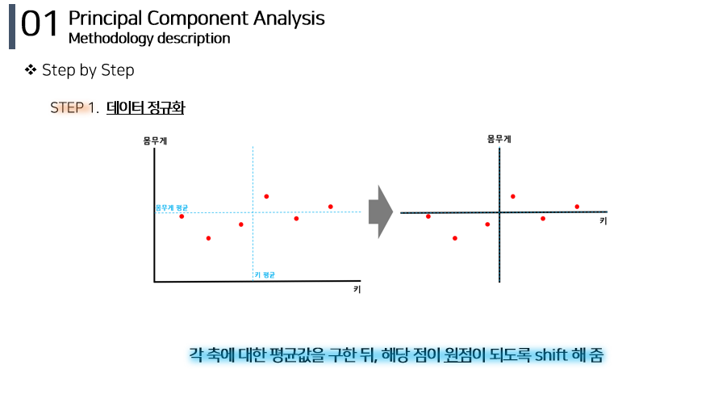
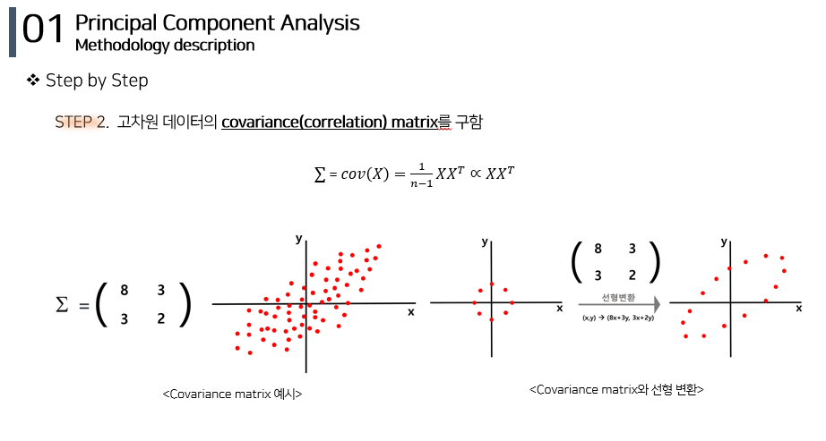
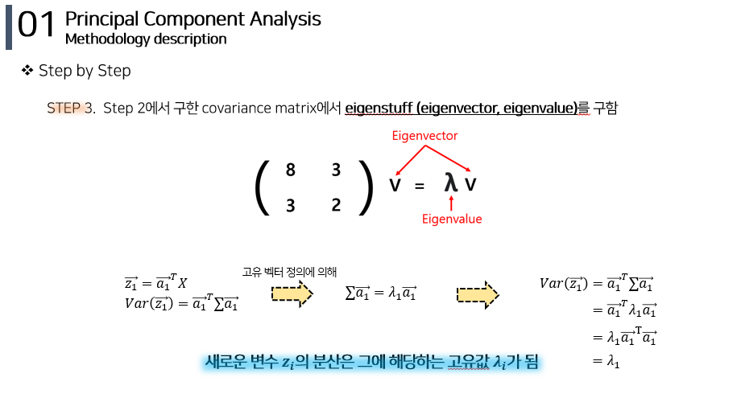

# PCA (Principal Component Analysis) 

데이터의 분산을 최대한 보존하면서 서로 직교하는 새 기저(축)를 찾아, 고차원 공간의 표본들을 선형 연관성이 없는 저차원 공간으로 변환하는 기법  
기존 변수를 선형 결합(linear combination)해 새로운 변수를 만들어 냄  

## 📚 PCA Methodology 
1. Step 1 : [데이터 정규화](#step-1)
2. Step 2 : [고차원 데이터의 covariance(correlation) matrix를 구함](#step-2)
3. Step 3 : [covariance matrix에서 eigenstuff (eigenvector, eigenvalue)를 구함](#step-3)
4. Step 4 : [Step 3에서 구한 eigenvalue가 큰 순서대로  정렬](#step-4--5) 
5. Step 5 : [줄이기 원하는 차원 개수만큼  eigenvector 남겨서 기존 변수 변환](#step-4--5)

## Step 1 

## Step 2 

## Step 3

## Step 4 & 5 

