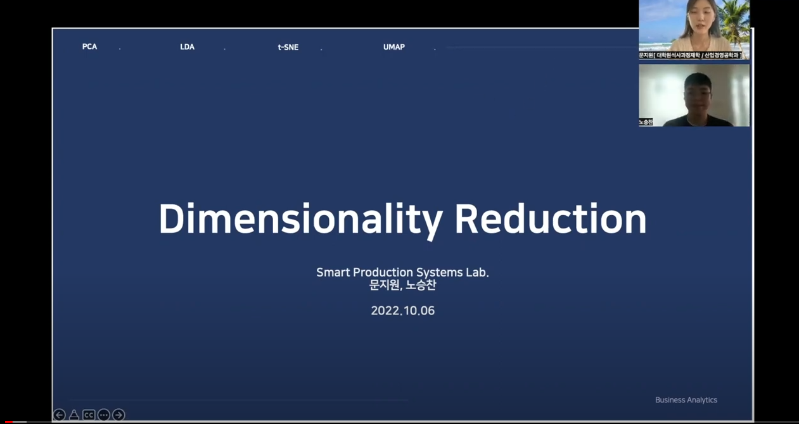
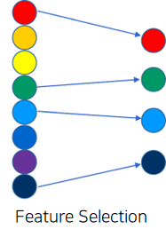
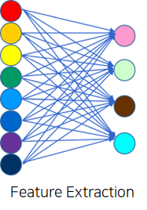
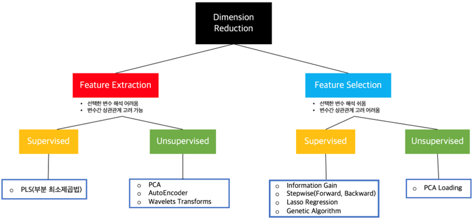

# Dimensionality Reduction 
[발표영상 링크](https://www.youtube.com/watch?v=7NM8J8Tko9g)
 

## 💡 차원축소란 ?
차원을 축소하는 방법론으로는 크게 feature selection과 feature extraction이 있다.  Feature Selection과 Feature Extraction은 모두 차원 감소를 통해 모델의 복잡성을 줄이고 overfitting을 막는 역할을 한다. 
### Feature Selection 
 
* 장점) 전체 변수 중 소수의 변수를 선택하는 것으로, 선택된 변수 해석이 용이
* 단점)  변수 간의 상관관계를 고려하기 어렵다
### Feature Extraction 
 
* 장점) feature selection이랑은 다르게 변수 간의 상관관계를 고려할 수 있고, 일반적으로 변수의 개수를 많이 줄일 수 있다
* 단점) Feature Selection과는 다르게 추출된 변수의 해석이 어렵다

### 지도 ? 비지도 ? 
 
Feature Selection과 Feature Extraction 각 방법에 있어서 Supervised와 Unsupervised로 구분할 수 있는데 Supervised와 Unsupervised의 차이점은 종속변수(Y)를 고려하여 변수를 추출(또는 선택)하냐이다.  
* Supervised Feature Selection : Information Gain, Stepwise, Lasso Regression, Genetic Algorithm 
* Supervised Feature Extraction :  PLS, LDA 
* Unsupervised Feature Selection : PCA Loading 
* Unsupervised Feature Extraction : PCA, Autoencoder, Wavelets Transforms

## 📚 목차 
1. [PCA tutorial](https://github.com/Moonmoonji/Business_Analytics-2022-/tree/main/Dimensionality_Reduction/PCA)
2. LDA
3. t-sne
4. [UMAP tutorial](https://github.com/Moonmoonji/Business_Analytics-2022-/tree/main/Dimensionality_Reduction/UMAP)
