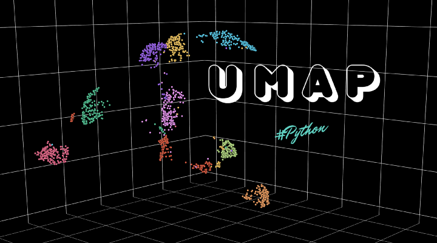
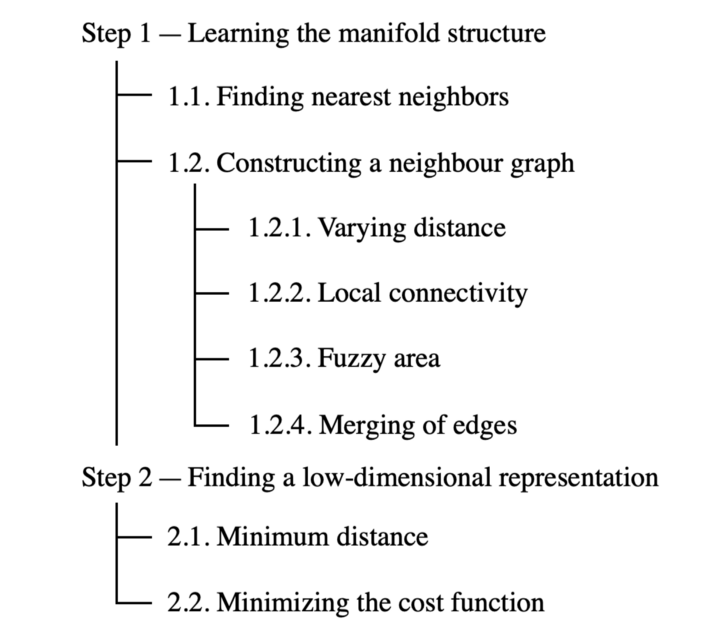
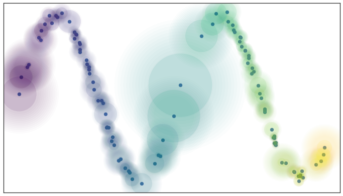
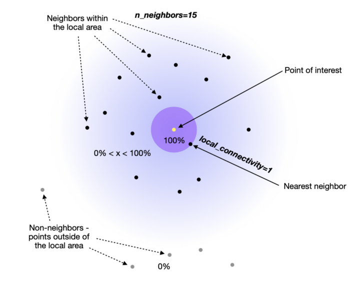
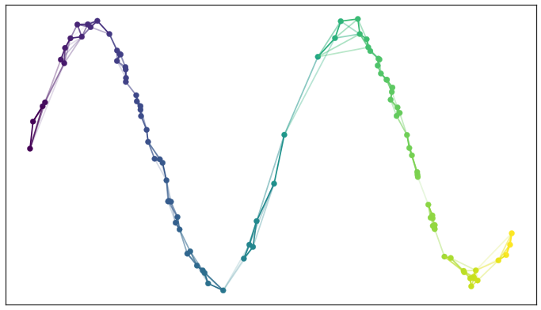
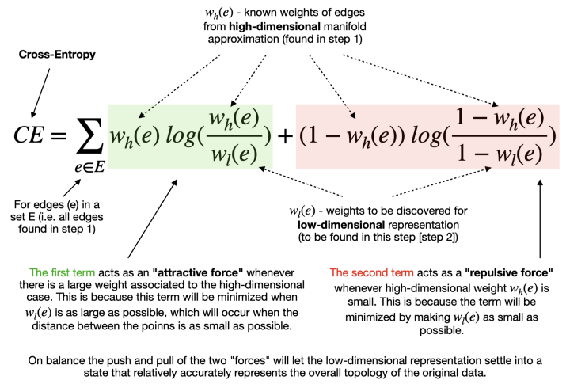

# UMAP (Uniform Manifold Approximation and Projection)

 

## Analyzing The UMAP name
<code>Projection</code> : 점을 평면, 곡면, 또는 선에 투영(projection)하여 공간 객체를 재현하는 프로세스 또는 기술이다. 고차원에서 저차원으로 매핑하는 기술  
<code>Approximation</code> : 알고리즘은 매니폴드를 구성하는 전체 집합이 아니라 데이터 샘플의 유한한 집합을 가정한다. 따라서 이용 가능한 데이터를 기반으로 매니폴드를 근사화할 필요가 있다.  
<code>Manifold</code> : Manifold는 국소적으로 각 점 근처의 유클리드 공간과 유사한 위상 공간이다.   
<code>Uniform</code> : Uniformity 가정은 데이터 샘플이 매니폴드에 걸쳐 균일하게 분포되어있음을 알려준다. 그러나 현실세계에서 이런 경우는 거의 없다. 따라서 이 가정은 매니폴드에 걸쳐 거리가 다르다는 개념으로 이어진다.  

즉 UMAP을 다음과 같이 정의할 수 있다.  
> 데이터 샘플이 매니폴드(manifold)에 걸쳐 균일(uniform)하게 분포되어있다고 가정하는 차원축소 기법이며, 이는 유한한 데이터 샘플에서 근사(approximation)하고, 저차원 공간에 투영(projection)될 수 있다.  

## UMAP Step별로 보기 
 

### 1. Learning the manifold structure
데이터를 저차원에 임베딩하기 전에 고차원에서 데이터 구조를 파악해야 한다. 

#### 1.1 Finding Nearest Neighbor 
n_neighbor이라는 hyperparameter는 local과 global구조의 균형을 맞추는 방법을 제어하는 역할을 한다. n_neighbor이 작다는 것은 미세한 구조를 정확하게 파악하는 로컬한 해석을 원한다는 것을 의미한다. 반대로 n_neighbor이 크다는 것은 추정치가 큰 지역을 기반으로 global한 구조를 파악하는 것을 의미한다. 

#### 1.2 Constructing a graph 
##### 1.2.1 Varying Dstance 
UMAP 이름 분석해서 언급했듯이, manifold 전체에 걸쳐 점들의 uniform 분포를 가정하며, 그들 사이의 공간이 데이터가 희박하거나 밀도가 높은 것으로 보이는 곳에 따라 늘어나거나 줄어든다. (그림 참고)  
  

즉, 거리 측정법이 전체 공간에 대해서 공통적이지 않고, 지역의 밀도마다 다르다는 것을 의미한다.

##### 1.2.2 Local Connectivity 
local_connectivity라는 hyperparameter를 통해 연결되지 않는 점을 설정할 수 있다.  
예를 들어 local_connectivity = 1 로 설정하면 고차원 공간의 모든 점이 적어도 하나의 다른 점에 연결된다. 

##### 1.2.3 Fuzzy Area 
위의 그림을 보면 알 수 있듯이 가장 가까운 이웃을 넘어 확장되는 fuzzy 원도 포함되어있다. 즉, 관심지점에서 멀어질수록 연결의 확실성이 감소된다는것을 의미한다. 보다 구체적으로 아래 그림과 같이 이해할 수 있다.   
 

##### 1.2.4 Merging of edges 
Fuzzy Area에서 언급한 연결의 확실성이 edge weight를 통해서 표현된다. 
최종적으로 완성된 그래프는 아래 그림과 같다. 

### 2. Finding Low-Dimensional Representation 
#### 2.1 Minimum Distance 
min_dist라는 hyperparameter를 통해서 포함된 점 사이의 최소 거리를 정의한다. 

#### 2.2 Minimizing Cost Function 
최소 거리(min_dist)를 지정하면 알고리즘은 좋은 저차원 매니폴드 표현을 찾을 수 있다. UMAP은 cross entropy라고하는 비용함수를 최소화함으로써 좋은 표현을 찾는다.  

 

위의 식을 통해 알 수 있듯이 최종 목표는 저차원 공간에서의 최적의 가장자리 가중치(edge weight)를 찾는 것이다. 이러한 최적 가중치는 반복적인 경사하강 프로세스에 의해서 cross entropy 비용 함수가 최소화됨에 따라 나타난다.

## Reference 
1. https://solclover.com/
2. https://towardsdatascience.com/umap-dimensionality-reduction-an-incredibly-robust-machine-learning-algorithm-b5acb01de568
3. https://umap-learn.readthedocs.io/en/latest/how_umap_works.html 
4. https://solclover.com/ 

