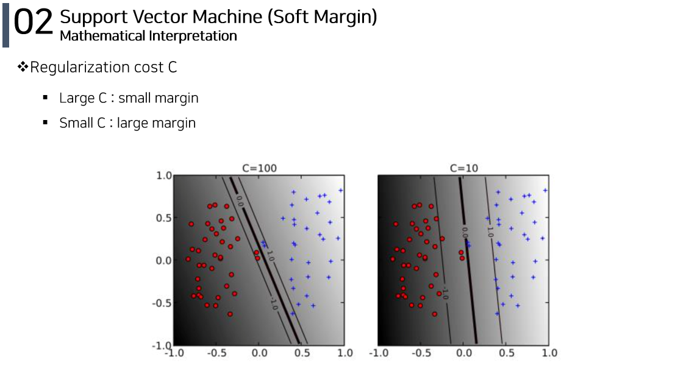

# Kernel-based Learning 
[발표영상 링크](https://www.youtube.com/watch?v=vdluqskMhfg)
 

## 💡 SVM이란 ?
* Hyperplane에 의해 공식적으로 정의되는 discriminative classifier  
* 레이블이 지정된 훈련 데이터(Supervised learning)가 주어지면, 최적의 hyperplane을 도출함

 

### Hard Margin 
#### Decision Rule 

 

 

 

 

 

 

 

 

### Soft Margin 
#### Decision Rule 

 

 

 

 

 

### Kernel SVM 

 

 

#### Decision Rule

 

 

 

 

