# Summary 
| Model      | Accuracy                    |
| ------------ | -------------------------- |
| `VAT` | 0.5 |
| `Noisy Student`   | 0.48 |
| `Pi`   | 0.6776 |
| `UDA`   | 0.846 |
| `MixMatch`   | 0.7002 |

# VAT 
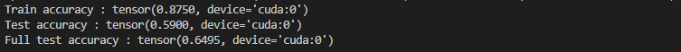 
Train Accuracy : 0.875
Test Accuracy : 0.5 

# Noisy Student
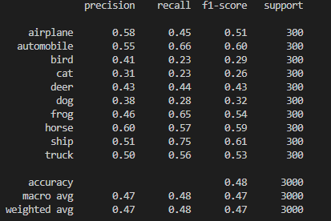 
Test Accuracy : 0.48

# Pi model
### Loss Plot
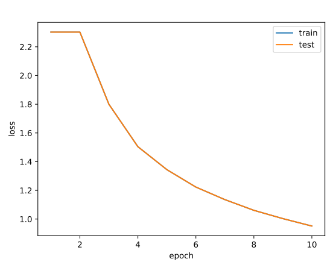
### Accuracy Plot
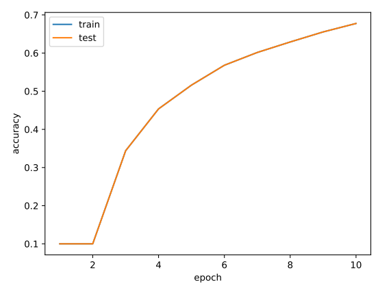

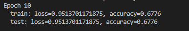 
Train Accuracy : 0.6776 
Test Accuracy : 0.6776 

# UDA
### Train Loss Plot
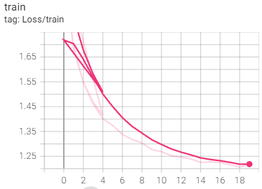
### Valid Loss Plot
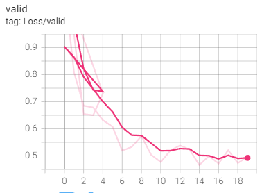
### Valid Accuracy Plot 
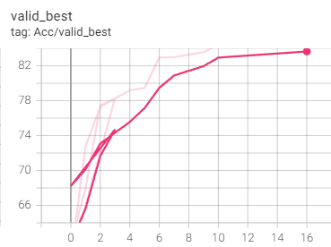 

Test Accuracy : 0.847

# MixMatch 
### Test Loss Plot 
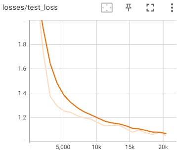
### Test Accuracy Plot
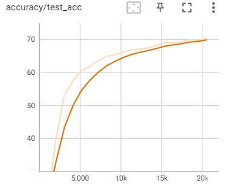
 

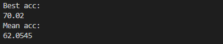 

Best Test Accuracy : 0.7002
Mean Test Accuracy : 0.6205
